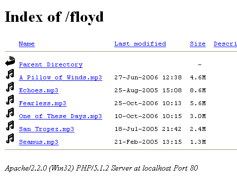
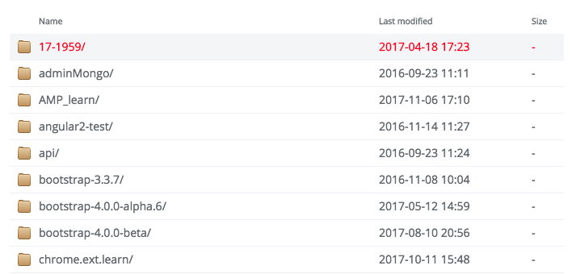

# Installation Apache on mac.
```
> sudo apachectl start
> apchectl -v
Server version: Apache/2.4.27 (Unix)
Server built:   Jul 15 2017 15:41:46
```


## Change website root
/etc/apache2/httpd.conf
```
DocumentRoot "/Library/WebServer/Documents"
<Directory "/Library/WebServer/Documents">
```
## Change page default style
Default page:



New page:



Reference-style: 
/etc/apache2/httpd.conf
1. AllowOverride All
```
AllowOverride All
```
2. Change Indexes
Change:
```
Options FollowSymLinks Multiviews
```
to:
```
Options FollowSymLinks Multiviews Indexes
```

3. Modify directory root permission
```
chown -R _www:_www 0projects/
```
## Change 127.0.0.1 to customize domain
```
> sudo vi/etc/hosts
127.0.0.1 project
```
## Change default page theme

[http://adamwhitcroft.com/apaxy/](http://adamwhitcroft.com/apaxy/)
